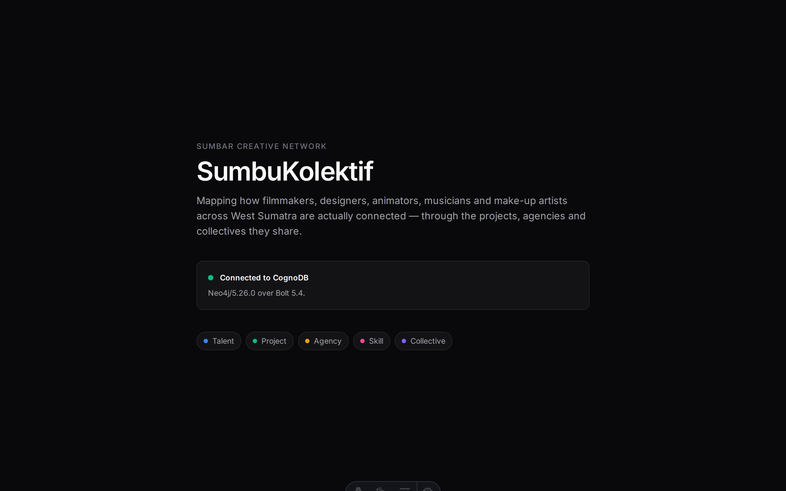
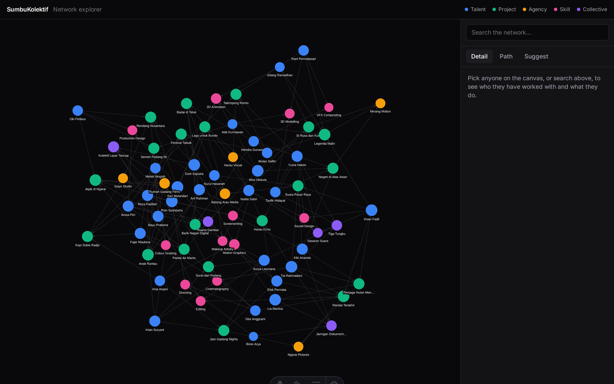
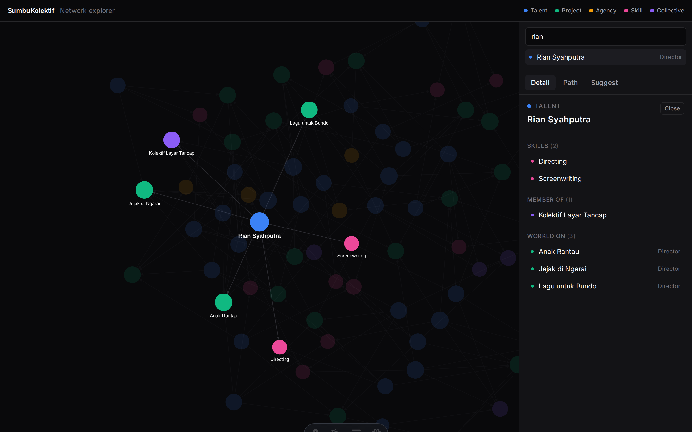
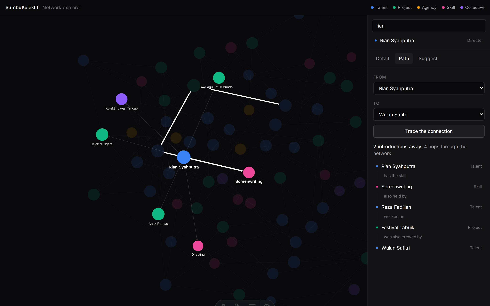
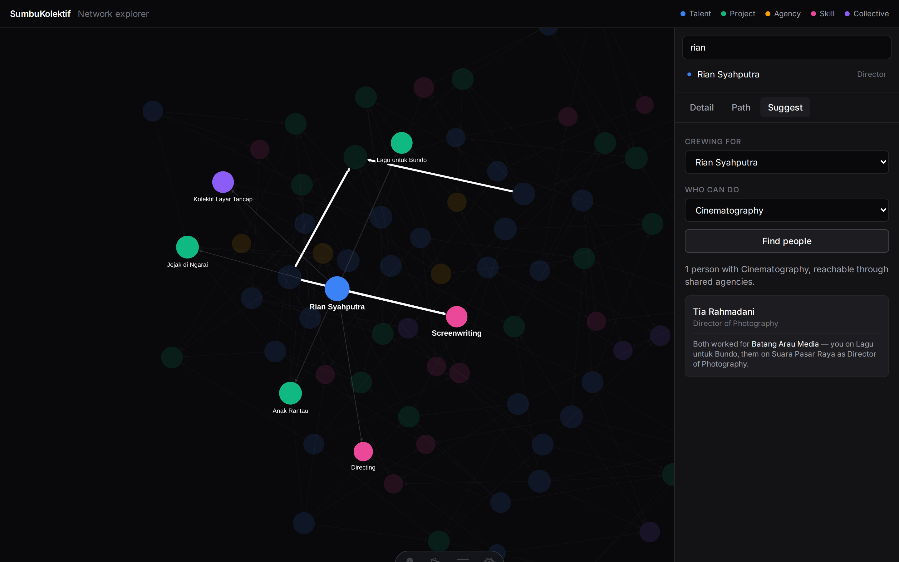
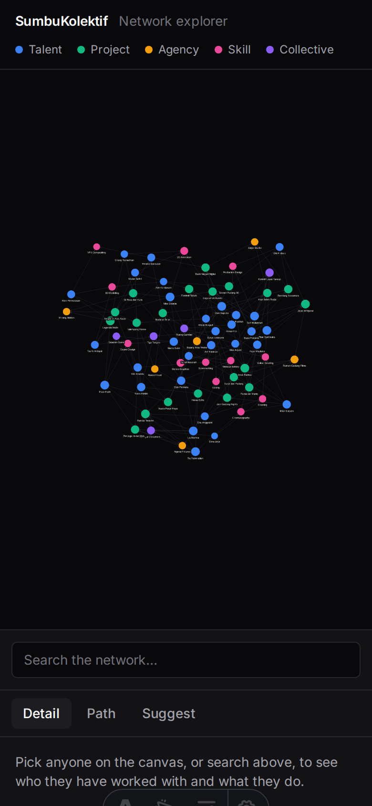
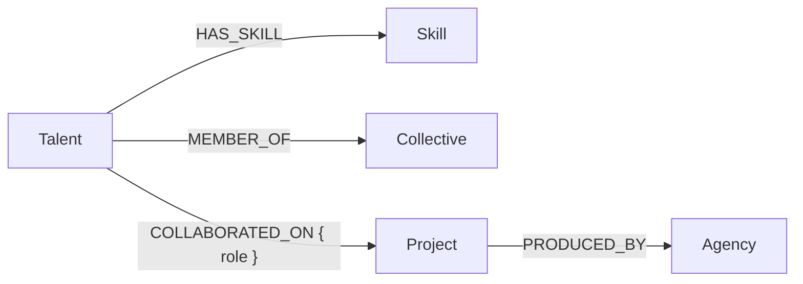

# SumbuKolektif

**Sumbar Creative Network** — a graph-backed web app that maps how filmmakers,
designers, animators, musicians and make-up artists across West Sumatra are
connected, through the projects, agencies and collectives they share.

Built for the Wexa AI take-home assignment. Astro 7 (SSR) + Svelte 5 islands on
Vercel, openCypher over Bolt against a CognoDB Cloud instance.

---

## What it is for

A producer in Padang needs a Director of Photography next month. The people they
already know are booked. The names they would trust next are one step further
out: someone who crewed a production at the same agency, someone in a
collaborator's collective. That knowledge exists, but it lives in group chats and
in whoever has been in the industry longest.

SumbuKolektif makes it queryable. Three things it answers:

1. **Who is out there, and how is anyone connected to anyone?** Search a person,
   project, agency, collective or skill; open it; see everything one hop away and
   keep walking.
2. **Who should I hire that I have not worked with?** Pick a person and a skill.
   The app returns people with that skill reachable through a shared production
   agency, and excludes anyone the requester has already shared a project with —
   the point is names you do not already have.
3. **How far apart are these two people?** Pick two talents and get the degrees
   of separation, plus the actual chain that produced the answer, including routes
   through a shared collective that no project-based query would find.

Every answer carries its evidence. A recommendation names the agency and both
productions that link the two people, so the reader can judge whether the
introduction is worth making.

## Screenshots

The landing page checks the database on every request, so the badge reflects the
live instance rather than build time.



All 73 nodes, laid out force-directed. Colour encodes type.



Opening a talent shows their skills, collectives and credits, with the role they
held on each production. Every neighbour is clickable.



The path finder reports degrees of separation, then reads the chain back as a
sentence and highlights it on the canvas. This route runs through a skill both
people hold and a festival they both crewed.



The recommendation explains itself: which agency, which production on each side,
and the role that person held.



Narrow widths stack the panels rather than splitting the screen.



---

## Why a graph database

The scene is held together by relationships, not by records. The questions people
ask about it — *"who else has this agency's directors worked with?"*, *"how do I
get an introduction to that colourist?"* — are questions about paths between
entities, and a relational schema answers those badly.

### Every hop costs a join

Finding animators indirectly connected to a director through a shared production
house means walking talent → project → agency → project → talent → skill. In SQL
each hop is another join:

```sql
-- Relational approach: eight joins to answer one question.
SELECT DISTINCT t2.name, s.name AS skill, a.name AS agency
FROM talents             t1
JOIN project_memberships pm1 ON pm1.talent_id  = t1.id
JOIN projects            p1  ON p1.id          = pm1.project_id
JOIN agencies            a   ON a.id           = p1.agency_id
JOIN projects            p2  ON p2.agency_id   = a.id
JOIN project_memberships pm2 ON pm2.project_id = p2.id
JOIN talents             t2  ON t2.id          = pm2.talent_id
JOIN talent_skills       ts  ON ts.talent_id   = t2.id
JOIN skills              s   ON s.id           = ts.skill_id
WHERE t1.name = $1
  AND s.name  = $2
  AND t2.id  <> t1.id;
```

Query A below is the same traversal in one pattern, and the shape of the query
mirrors the shape of the question.

### Shortest path has no fixed number of joins to write

The eight joins above are at least knowable in advance. Degrees of separation are
not: the answer might be two hops or five, and the route might run through a
project, an agency, or a shared collective. SQL needs a recursive CTE that
breadth-first searches the graph by hand, carries a visited-set to avoid cycling,
and still has to be told where to stop:

```sql
-- Relational approach: hand-rolled BFS, and this is the simplified version.
WITH RECURSIVE reachable(from_id, to_id, depth, visited) AS (
  SELECT id, id, 0, ARRAY[id] FROM talents WHERE id = $1
  UNION ALL
  SELECT r.from_id, e.to_id, r.depth + 1, r.visited || e.to_id
  FROM reachable r
  JOIN talent_edges e ON e.from_id = r.to_id
  WHERE r.depth < 4
    AND NOT e.to_id = ANY(r.visited)   -- cycle guard we must maintain ourselves
)
SELECT MIN(depth) FROM reachable WHERE to_id = $2;
```

It also throws away the thing the UI needs to display: the path itself, node by
node. Cypher's `shortestPath()` hands that back as a value, which is what the
panel in screenshot 4 renders.

### At scale

Index-free adjacency makes a hop a pointer dereference, so traversal cost tracks
the size of the neighbourhood rather than the size of a table; relational joins
re-consult an index on every hop and the intermediate result sets multiply.
Adding `(:Talent)-[:MENTORED_BY]->(:Talent)` later is one new relationship type,
where in SQL it is a new table plus a rewrite of every traversal query that ought
to consider it. And a relationship carries properties: `COLLABORATED_ON { role:
"Director of Photography" }` puts the role on the edge instead of in a junction
table every query has to remember to join.

---

## Data model

Five node labels, four relationship types.



| Node | Is | Key properties |
| --- | --- | --- |
| `Talent` | A person: director, DoP, animator, musician, MUA, 3D visualiser. | `id`, `name`, `role`, `location`, `bio` |
| `Skill` | A craft someone can be hired for. | `id`, `name` (unique), `category` |
| `Project` | A production: film, series, campaign, festival. | `id`, `title`, `year`, `type` |
| `Agency` | The company that produced a project. | `id`, `name`, `type`, `city` |
| `Collective` | An informal group people belong to outside any company. | `id`, `name`, `city`, `focus` |

`Collective` earns its place because of the routes it opens. Two talents in the
seeded graph, Yusra Hakim and Elok Permata, share no project, no skill and no
agency. They are two hops apart through `Tiga Tungku`, a collective they both
belong to. A project-based query would report them as unconnected.

Two properties of this schema matter downstream, and the first is that every node
carries an `id`, `Skill` included. The explorer addresses nodes uniformly
(expand this one, inspect that one), and a type that had to be looked up by a
different property would force a special case into every one of those paths.
`Skill.name` still has to stay unique, because that is what `MERGE` deduplicates
on. Nothing anywhere keys on `elementId()`: this instance returns a
bare counter rather than Neo4j's `4:<uuid>:1`, and it changes on every re-seed.

The graph is also bipartite. `Talent` and `Agency` sit on one side, `Skill`,
`Collective` and `Project` on the other, and all four relationship types cross
between the two. So a path leaving a talent can only arrive back at a talent
after an even number of hops. Distances are 2 or 4, never 1, 3 or 5. That is
what lets the UI say "one introduction away" or "two introductions away" without
ever having to phrase an odd case, and it is also why raising the hop budget from
4 to 5 would buy nothing.

The seeded dataset holds 73 nodes and 161 relationships: 30 talents, 20 projects,
12 skills, 6 agencies, 5 collectives.

---

## How it works

```text
[ Browser — Svelte island: graph canvas + inspector ]
            │
            │ fetch() → JSON
            ▼
[ Astro SSR routes (src/pages/api/*) on Vercel Functions ]
            │
            │ parameterized Cypher over Bolt TLS
            ▼
[ CognoDB managed graph instance ]
```

Nothing is prerendered. Every page depends on live graph data, so `astro.config`
sets `output: 'server'` and each request renders on a Vercel Function.

**The canvas is a client-only island.** Cytoscape's `fcose` layout touches
`window`, so `GraphCanvas.svelte` mounts with `client:only="svelte"` and never
runs during SSR. That leaves the server with nothing to paint on first request,
which is why `explore.astro` passes a `slot="fallback"` — it is server-rendered
and swapped out on hydration, so the first frame says "Starting the explorer…"
instead of being blank. The island calls `cy.destroy()` on unmount.

**One driver per process.** All database access goes through the singleton in
`src/lib/cognodb.ts`; nothing else calls `neo4j.driver()`. A serverless function
handles many requests before it is frozen, so a driver per request would leak
sockets and burn through the instance's 200-connection ceiling. The pool is
capped at 10 with a 10 s acquisition timeout, queries run through
`session.executeRead()` so the driver retries transient failures, and sessions
close in a `finally`. `disableLosslessIntegers: true` keeps Cypher integers from
arriving as `{low, high}` objects.

**Every value is a parameter.** No Cypher string in this repo is built by
concatenation or template literal. The one case where that is not enough is
`/api/node`, because Cypher cannot parameterize a *label* and a label-less
`MATCH (n {id: $id})` scans every node. The resolution is a lookup table of five
complete, pre-written queries keyed by label, built at module load. A request's
label gets checked against the map's own keys and is then only ever used as a map
key. It never touches a query string. And the lookup function is typed to the
five-literal union, so handing it a request-supplied `string` fails `npm run
check` rather than reaching review.

### API surface

Every route is `GET`, answers `{ data }` on success and `{ error: { code,
message } }` otherwise, and runs exactly one query from `src/lib/graph.ts`.
Validation and error mapping are the only logic in a route.

| Route | Parameters | Returns |
| --- | --- | --- |
| `/api/graph` | — | The whole graph, one payload. |
| `/api/node` | `id`, `label` | One node and everything one hop away. |
| `/api/search` | `q` (min 2 chars) | Up to 15 matches across all five labels. |
| `/api/recommendations` | `talentId`, `skill` | Query A. |
| `/api/path` | `from`, `to` | Query B. |
| `/api/health` | — | 503 when the database is unreachable. |

### When things break

Failures sort into three kinds because they deserve three different answers:

| Thrown | Meaning | HTTP |
| --- | --- | --- |
| `DatabaseConfigError` | Environment variables missing — a deployment mistake. | 500 `DATABASE_NOT_CONFIGURED` |
| `DatabaseUnavailableError` | Instance unreachable, auth rejected, or a transient fault. | 503 `DATABASE_UNAVAILABLE` + `Retry-After: 5` |
| anything else | Our bug. Logged in full server-side, never echoed. | 500 `INTERNAL_ERROR` |

The message on `DatabaseUnavailableError` is deliberately generic: an
authentication failure must not tell a visitor the password was wrong. The driver
code stays on `.code`, the original error on `.cause`. Both server-side only.

When the database is down, pages still return 200 and say so. The path and
suggest panels hide their controls in that state rather than offering a form that
cannot answer, and search keeps working, because `/api/search` reaches the
database on its own and a hit can open the inspector even when the canvas is
dark.

Empty is an answer, not an error. `/api/recommendations` with no matches,
`/api/path` with no route inside the hop budget, and `/api/graph` against an
unseeded database all answer 200. `/api/node` is the exception and answers 404
when the id does not exist, because its query returns a row even for a node with
no connections — so no row can only mean the node is absent.

---

## The two queries that matter

### Query A — multi-hop recommendation

Four hops talent to talent, five relationships: `t1 → p1 → agency ← p2 ← t2 → skill`.

```cypher
MATCH (t1:Talent {id: $talentId})-[:COLLABORATED_ON]->(p1:Project)-[:PRODUCED_BY]->(agency:Agency)
MATCH (agency)<-[:PRODUCED_BY]-(p2:Project)
      <-[c2:COLLABORATED_ON]-(t2:Talent)-[:HAS_SKILL]->(s:Skill {name: $skill})
WHERE t1 <> t2
  AND COUNT { (t1)-[:COLLABORATED_ON]->(:Project)<-[:COLLABORATED_ON]-(t2) } = 0
RETURN DISTINCT
  t2.id       AS talentId,
  t2.name     AS talentName,
  t2.role     AS talentRole,
  c2.role     AS roleOnProject,
  s.name      AS skill,
  agency.name AS viaAgency,
  p1.title    AS yourProject,
  p2.title    AS theirProject
ORDER BY talentName
LIMIT 20;
```

Reading it: start at the requester, walk out to the productions they crewed, up
to the agencies that produced those, back down to *other* productions from the
same agencies, across to the people who crewed those, and finally to the skill
being hired for. The `viaAgency` / `yourProject` / `theirProject` triple is what
lets the UI explain *why* someone was recommended instead of listing them.

The `COUNT { … } = 0` clause is what makes the result useful — it drops anyone
the requester has already shared a project with. It is written that way because
the natural spelling is broken on this instance:

```cypher
-- Correct Cypher. Wrong answers on CognoDB.
WHERE NOT (t1)-[:COLLABORATED_ON]->(:Project)<-[:COLLABORATED_ON]-(t2)
```

`EXISTS()` over a pattern does not read the graph once both endpoints are bound;
it answers the same constant for every pair, whatever the data says. Against the
seeded graph that constant is `false`, so negating it excluded nobody and the
recommendation list quietly filled with people the requester had already worked
with, including rows where `yourProject` and `theirProject` were the same
production. Nothing errored; the query answered a different question.
`COUNT { }` does read the graph. Swapping it in changed no results across 40
talent-and-skill combinations and cost nothing measurable. `npm run probe` checks
both spellings against a fixture containing a sharing pair *and* a non-sharing
pair, since checking only a sharing pair would pass on a constant `true` and
prove nothing.

### Query B — shortest path

```cypher
MATCH (a:Talent {id: $fromId}), (b:Talent {id: $toId})
MATCH path = shortestPath((a)-[*..4]-(b))
RETURN
  length(path)                         AS degrees,
  [n IN nodes(path) | {
    id:    n.id,
    label: head(labels(n)),
    name:  coalesce(n.name, n.title)
  }]                                   AS pathNodes,
  [r IN relationships(path) | type(r)] AS pathTypes;
```

This is the one that would be genuinely awkward in an RDBMS — the recursive CTE
above is its SQL equivalent, and that version cannot return the path.

The pattern is undirected, which is the point: a route may run forwards along one
relationship and backwards along the next, and a shared collective is as valid a
link as a shared production. Returning `pathNodes` and `pathTypes` alongside the
length is what lets the panel render the chain as a sentence rather than a
number.

**Why `[*..4]` and not `[*..6]`.** The hop budget is a real cost. On a graph this
dense, a 6-hop or unbounded search on the free tier (0.5 vCPU / 256 MB) expands
into a very large frontier before it terminates, and four hops already covers
every connection a person would recognise as one. Nothing comes back when no
route exists inside the budget. The UI renders that as an explicit "no known
connection" rather than an error.

Three more queries back the UI: a one-hop neighbourhood expansion per label
(`OPTIONAL MATCH`, so an isolated node returns a row with an empty neighbour list
instead of a spurious "not found"), a case-insensitive substring search, and the
whole-graph overview. All five are written out with their reasoning in
[`docs/database.md`](docs/database.md) §3.

---

## Running it locally

Node 22.12 or newer, and a CognoDB Cloud instance (the free `c0` tier is enough).

```bash
git clone https://github.com/rafimaryudwika/kolektif-kreatif-sumbar.git
cd kolektif-kreatif-sumbar
npm install
```

Copy the environment template and fill in the three values from
[console.cognodb.com](https://console.cognodb.com). The generated password is
shown exactly once, when the instance is created.

```bash
cp .env.example .env
```

| Variable | Example |
| --- | --- |
| `COGNODB_URL` | `bolt+s://<instance-id>.databases.cognodb.com` |
| `COGNODB_USERNAME` | `cognodb` |
| `COGNODB_PASSWORD` | *(secret)* |

`.env` is gitignored and no credential is ever committed. The same three
variables go into the Vercel project settings for a deployed build.

Confirm the instance is reachable and still supports the Cypher this app relies
on, then load the dataset:

```bash
npm run probe   # connectivity + shortestPath, variable-length paths, constraints, MERGE
npm run seed    # wipes and repopulates the graph
npm run dev     # http://localhost:4321
```

Two probe checks report `N/A` on purpose: CognoDB has no `dbms.components()`
procedure and rejects `CALL { } IN TRANSACTIONS` as a syntax error. The app codes
around both. A `FAIL` means something genuinely regressed.

The seed script wipes the graph, applies the constraints and indexes, inserts the
dataset, then runs Queries A and B against what it just wrote and exits non-zero
if either comes back empty. A seed that leaves the recommendation query empty is
a broken seed, so that check lives in the script rather than in a manual
follow-up. Uniqueness constraints make `MERGE` idempotent, so re-seeding updates
the existing nodes instead of growing a second copy of the graph.

### Other commands

| Command | Does |
| --- | --- |
| `npm run check` | `astro check`, then `svelte-check --threshold error` |
| `npm run build` | Production SSR build through the Vercel adapter |
| `npm run preview` | Serve the built output |

Both type-checkers run because `astro check` does not look inside `.svelte`
files. On its own it has already passed a component calling a function it never
imported, and another handing a prop the wrong shape.

---

## Layout

```text
src/
├── components/     Svelte islands: GraphCanvas, Inspector, SearchBox,
│                   PathPanel, RecommendPanel, and the Explorer that owns them
├── layouts/        Layout.astro
├── lib/
│   ├── cognodb.ts       The driver singleton, readQuery(), checkHealth()
│   ├── graph.ts         Every Cypher query, one exported function each
│   ├── api.ts           jsonOk, toErrorResponse, requireParam
│   ├── client.ts        Typed fetch wrapper used by the islands
│   ├── graph-style.ts   Cytoscape stylesheet, tokens read from CSS at mount
│   └── relationships.ts Relationship types rendered as English
├── pages/
│   ├── api/        graph, node, search, recommendations, path, health
│   ├── index.astro Landing page with the live connection badge
│   └── explore.astro
└── styles/global.css    Tailwind v4 @theme tokens

scripts/
├── seed.ts              npm run seed
└── probe-cognodb.js     npm run probe

docs/
├── PRD.md               Scope and deliverables
├── database.md          Schema, all five queries, and the reasoning behind them
├── architecture.md      Connection lifecycle, error taxonomy, API contract
└── design-system.md     Tokens, type scale, motion
```

## Known advisory

`npm audit` reports three high-severity findings that all trace to one root:
`@astrojs/vercel@11.0.5`, the current release, pins `@vercel/routing-utils@5.3.3`,
which depends on `path-to-regexp@6.1.0` and its ReDoS advisory for backtracking
regular expressions.

No upstream fix exists yet, and `npm audit fix --force` downgrades the adapter and
breaks the build. The package runs at build time, compiling our own route patterns
from `astro.config.mjs` into Vercel's routing manifest; it never sees request-time
input. Revisit when `@astrojs/vercel` bumps the dependency.
